# COVID-19 Analytics AWS Project — Project Steps

## Purpose

This document explains how I completed the AWS COVID-19 analytics project.

I used this project to practice building a cloud-based data pipeline with AWS services. The goal was to take raw COVID-19 datasets, store them in an S3 data lake, transform them with AWS Glue PySpark jobs, query the transformed data with Athena, and validate the final Gold layer in Redshift Serverless.

This document is written as a practical build record. It explains what I actually did, the AWS services I used, and the issues I faced while completing the project.

---

## Project Summary

This project follows a Bronze, Silver, and Gold data lake pattern.

- **Bronze layer** stores the original raw CSV files.
- **Silver layer** stores cleaned and standardized Parquet data.
- **Gold layer** stores analytics-ready dimension and fact tables.

The final Gold data was queried in Athena and also loaded into Redshift Serverless for warehouse validation.

---

## Services and Tools Used

| Service / Tool | How It Was Used |
|---|---|
| Amazon S3 | Stored Bronze, Silver, and Gold data lake layers |
| AWS Glue ETL | Ran PySpark transformation jobs |
| AWS Glue Data Catalog | Stored table metadata created through Athena external tables |
| Amazon Athena | Created external tables and queried S3 Parquet data |
| Amazon Redshift Serverless | Loaded Gold data into warehouse tables for validation |
| AWS IAM | Managed permissions for Glue and Redshift |
| PySpark | Used for data cleaning, standardization, joins, and business transformations |
| SQL | Used for Athena external tables, validation queries, BI queries, and Redshift DDL/COPY |
| Parquet | Used as the optimized storage format for Silver and Gold data |

## Final Architecture

```text
Raw CSV Files
        ↓
Amazon S3 Bronze Layer
        ↓
AWS Glue ETL Job: Bronze to Silver
        ↓
Amazon S3 Silver Layer
        ↓
Athena External Tables
        ↓
AWS Glue Data Catalog
        ↓
Athena Silver Validation
        ↓
AWS Glue ETL Job: Silver to Gold
        ↓
Amazon S3 Gold Layer
        ↓
Athena External Tables
        ↓
AWS Glue Data Catalog
        ↓
Athena BI Analytics Queries
        ↓
Redshift Serverless COPY Load Validation
```

---

## Step 1 — Create the S3 Data Lake Structure

### Service used

Amazon S3

### What I did

I created the main project path in S3:

```text
s3://covid-19-analytics-avishek/covid/
```

Inside the `covid/` folder, I used three main layers:

```text
covid/
├── bronze/
├── silver/
└── gold/
```

### Why this step was needed

The project follows a Medallion Architecture:

| Layer | Purpose |
|---|---|
| Bronze | Stores raw source data |
| Silver | Stores cleaned and standardized data |
| Gold | Stores business-ready analytics data |

This structure helped keep the raw, cleaned, and final analytics datasets separate.

### Screenshot reference

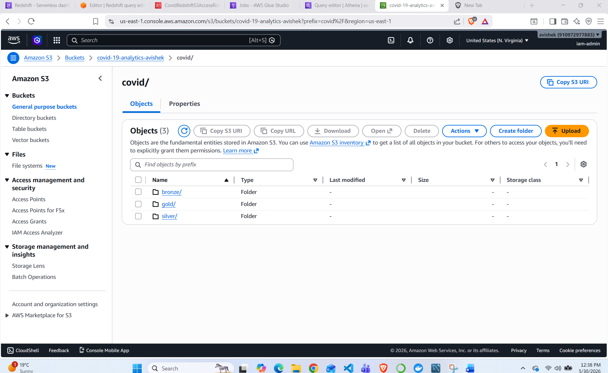

---

## Step 2 — Create Bronze Folders

### Service used

Amazon S3

### What I did

I created separate Bronze folders for each source dataset:

```text
covid/bronze/covid_tracking/
covid/bronze/nytimes/
covid/bronze/static/
```

### Folder purpose

| Folder | Purpose |
|---|---|
| `covid_tracking/` | Stores COVID testing data |
| `nytimes/` | Stores COVID case/death data |
| `static/` | Stores state abbreviation lookup data |

### Why this step was needed

The raw datasets came from different sources. Keeping them in separate folders made it easier for the Glue jobs to read each file clearly.

### Screenshot reference

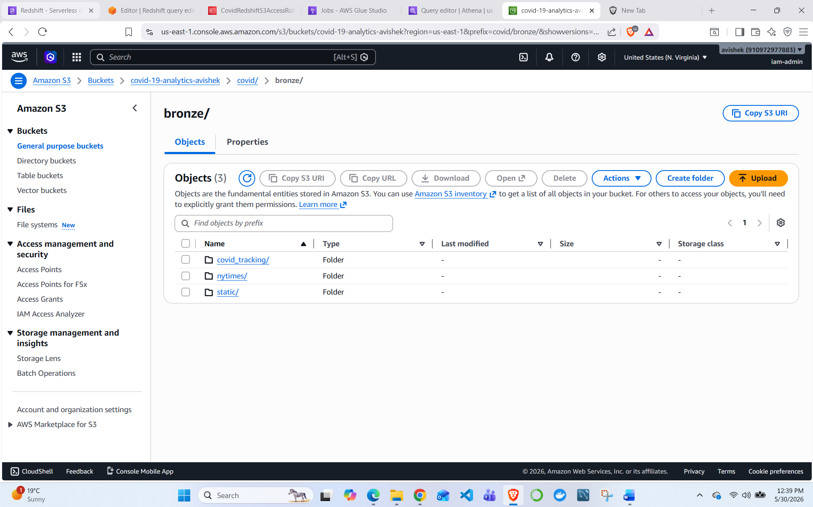

---

## Step 3 — Upload Raw COVID Datasets

### Service used

Amazon S3

### Files uploaded

| File | Uploaded To | Purpose |
|---|---|---|
| `states_daily.csv` | `covid/bronze/covid_tracking/` | COVID testing metrics |
| `us_states.csv` | `covid/bronze/nytimes/` | COVID cases and deaths |
| `states_abv.csv` | `covid/bronze/static/` | State name and abbreviation lookup |

### What I did

I uploaded the three source CSV files to their correct Bronze folders and confirmed that the files appeared in S3.

### Why this step was needed

The Bronze layer keeps the original files unchanged. This is useful because the pipeline can be rerun from the original source data if needed.

### Screenshot references

[COVID Tracking File Uploaded](../screenshots/03_bronze_covid_tracking_file.png)
[NYTimes File Uploaded](../screenshots/04_bronze_nytimes_file.png)
[Static State Lookup File Uploaded](../screenshots/05_bronze_static_file.png)


---

## Step 4 — Create IAM Role for AWS Glue

### Service used

AWS IAM

### Role used

```text
AWSGlueServiceRole-CovidAnalytics
```

### Permissions used

The Glue role needed access to read from S3, write to S3, run Glue jobs, and work with Athena/Glue metadata.

The role included permissions such as:

```text
AmazonAthenaFullAccess
AmazonS3FullAccess
AWSGlueServiceRole
```

### Why this step was needed

AWS Glue runs as an AWS service. Without an IAM role, the Glue job would not be allowed to read the raw files from S3 or write transformed output back to S3.

### Screenshot reference

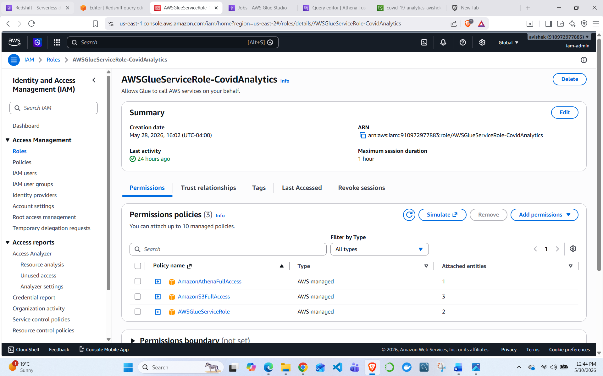

---

## Step 5 — Create Glue ETL Job: Bronze to Silver

### Service used

AWS Glue ETL

### Job name

```text
covid-bronze-to-silver
```

### Job purpose

This Glue job read the raw Bronze CSV files, standardized the fields, cleaned/cast the data, and wrote Silver Parquet output.

### Inputs

```text
s3://covid-19-analytics-avishek/covid/bronze/nytimes/us_states.csv
s3://covid-19-analytics-avishek/covid/bronze/covid_tracking/states_daily.csv
s3://covid-19-analytics-avishek/covid/bronze/static/states_abv.csv
```

### Outputs

```text
s3://covid-19-analytics-avishek/covid/silver/cases_standardized/
s3://covid-19-analytics-avishek/covid/silver/testing_standardized/
```

### Main work completed

In this Glue job, I worked on:

- reading the raw CSV files from S3
- converting dates into a standard `full_date` column
- standardizing state names and state codes
- casting numeric fields to proper numeric types
- creating partition columns: `state_code`, `year`, `month`, and `day`
- writing the cleaned output as Parquet

### Cases standardized fields

```text
full_date
state_name
state_code
cases_cum
deaths_cum
year
month
day
```

### Testing standardized fields

```text
full_date
state_code
state_name
tests_total_cum
tests_pos_cum
tests_neg_cum
year
month
day
```

### Why Parquet was used

Parquet was used because it is:

```text
Columnar
Compressed
Faster for analytics queries
Better for Athena scan cost compared to CSV
```

### Screenshot reference

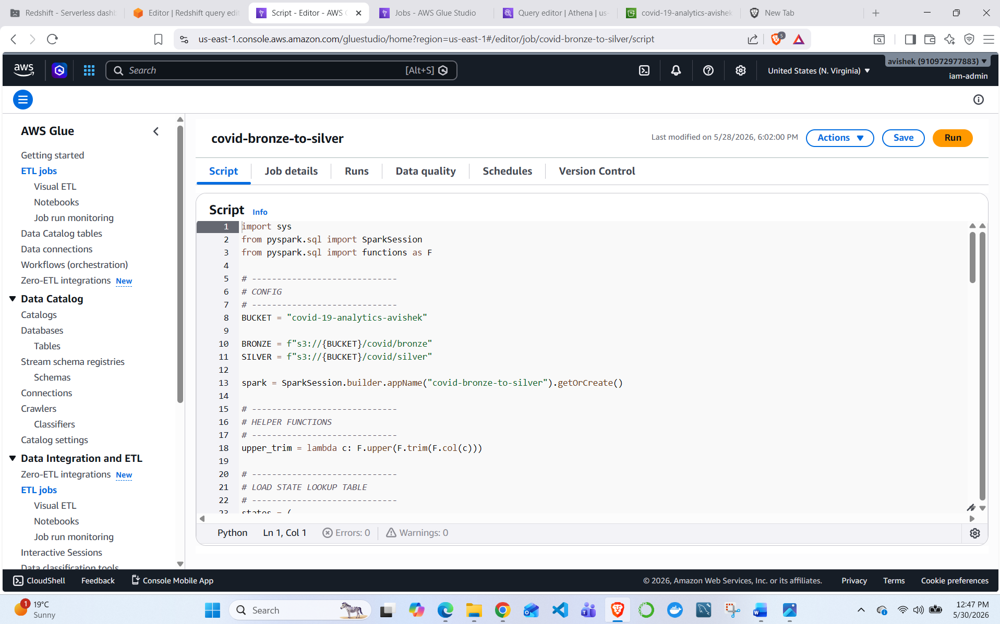

---

## Step 6 — Validate Silver Output in S3

### Service used

Amazon S3

### What I checked

After running the Bronze-to-Silver Glue job, I checked that these folders were created in S3:

```text
covid/silver/cases_standardized/
covid/silver/testing_standardized/
```

I also checked partitioned output folders under the Silver layer.

### Why this step was needed

This confirmed that the first Glue job successfully created cleaned Parquet output.

### Screenshot references

[S3 Silver Layer Folders](../screenshots/06_s3_silver_layer_folders.png)
[Silver Cases Partition Output](../screenshots/10_silver_cases_partition_output.png)
[Silver Testing Partition Output](../screenshots/11_silver_testing_partition_output.png)


---

## Step 7 — Create Silver External Tables in Athena

### Services used

Amazon Athena, AWS Glue Data Catalog, Amazon S3

### Table creation approach

I created the Athena external tables manually using SQL. The table metadata was stored in the AWS Glue Data Catalog.

### What I created

```text
Database: covid_silver_db
Table: cases_standardized
Table: testing_standardized
```

### Example SQL pattern

```sql
CREATE DATABASE IF NOT EXISTS covid_silver_db;
```

Example external table pattern:

```sql
CREATE EXTERNAL TABLE IF NOT EXISTS covid_silver_db.cases_standardized (
    full_date date,
    state_name string,
    cases_cum bigint,
    deaths_cum bigint
)
PARTITIONED BY (
    state_code string,
    year int,
    month int,
    day int
)
STORED AS PARQUET
LOCATION 's3://covid-19-analytics-avishek/covid/silver/cases_standardized/';
```

### Partition repair

Because the Silver output was partitioned, I ran partition repair commands:

```sql
MSCK REPAIR TABLE covid_silver_db.cases_standardized;
MSCK REPAIR TABLE covid_silver_db.testing_standardized;
```

### Why this step was needed

Athena needs external table definitions to query Parquet files in S3. Since the Silver data was partitioned, Athena also needed the partition metadata registered in the Glue Data Catalog.

### Screenshot references

[Athena Create Silver Tables](../screenshots/12_athena_create_silver_tables.png)
[Glue Catalog Silver Tables](../screenshots/13_glue_catalog_silver_tables.png)


---

## Step 8 — Validate Silver Layer in Athena

### Service used

Amazon Athena

### What I checked

I used Athena SQL queries to confirm that Silver tables were readable.

Example checks included:

```sql
SELECT *
FROM covid_silver_db.cases_standardized
LIMIT 10;
```

```sql
SELECT *
FROM covid_silver_db.testing_standardized
LIMIT 10;
```

```sql
SELECT
    MIN(full_date) AS min_date,
    MAX(full_date) AS max_date,
    COUNT(*) AS total_rows
FROM covid_silver_db.cases_standardized;
```

### Why this step was needed

This step confirmed that Athena could read the partitioned Parquet data before I built the Gold layer.

---

## Step 9 — Create Glue ETL Job: Silver to Gold

### Service used

AWS Glue ETL

### Job name

```text
covid-silver-to-gold
```

### Job purpose

This second Glue job created the analytics-ready Gold layer using a simple star schema.

### Inputs

```text
s3://covid-19-analytics-avishek/covid/silver/cases_standardized/
s3://covid-19-analytics-avishek/covid/silver/testing_standardized/
```

### Outputs

```text
s3://covid-19-analytics-avishek/covid/gold/dim_date/
s3://covid-19-analytics-avishek/covid/gold/dim_state/
s3://covid-19-analytics-avishek/covid/gold/fact_cases_state_daily/
s3://covid-19-analytics-avishek/covid/gold/fact_testing_state_daily/
```

### Gold data model

```text
dim_date
dim_state
fact_cases_state_daily
fact_testing_state_daily
```

### dim_date

```text
date_id
full_date
year
month
day
dow
is_weekend
```

### dim_state

```text
state_code
state_name
```

### fact_cases_state_daily

```text
date_id
state_code
cases_cum
deaths_cum
new_cases
new_deaths
```

### fact_testing_state_daily

```text
date_id
state_code
tests_total_cum
tests_pos_cum
tests_neg_cum
new_tests
positivity_rate
```

### Business logic

Daily metrics were calculated from cumulative values.

```text
new_cases = current_day_cases_cum - previous_day_cases_cum
new_deaths = current_day_deaths_cum - previous_day_deaths_cum
new_tests = current_day_tests_total_cum - previous_day_tests_total_cum
positivity_rate = tests_pos_cum / tests_total_cum
```

### Why this step was needed

The Silver layer was cleaned data. The Gold layer made it easier to run analytics queries by organizing the data into dimension and fact tables.

### Screenshot reference

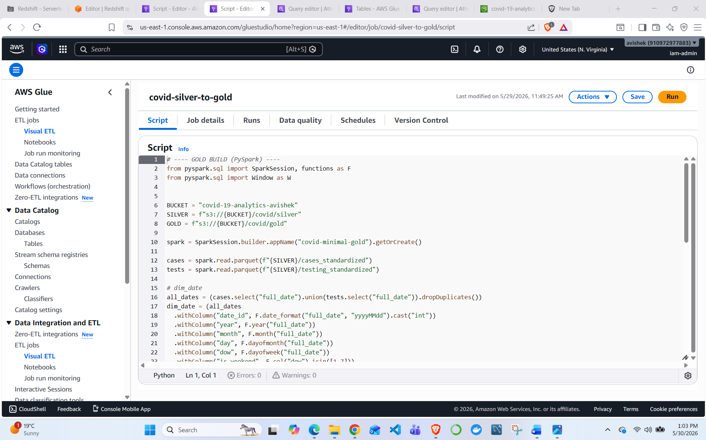

---

## Step 10 — Validate Gold Output in S3

### Service used

Amazon S3

### What I checked

After running the Silver-to-Gold job, I checked that these Gold folders were created:

```text
covid/gold/dim_date/
covid/gold/dim_state/
covid/gold/fact_cases_state_daily/
covid/gold/fact_testing_state_daily/
```

### Why this step was needed

This confirmed that the second Glue job successfully created analytics-ready Parquet output.

### Screenshot references

[S3 Gold Layer Folders](../screenshots/07_s3_gold_layer_folders.png)
[Gold Dim Date Output](../screenshots/15_gold_dim_date_output.png)
[Gold Dim State Output](../screenshots/16_gold_dim_state_output.png)
[Gold Fact Cases Partitions](../screenshots/17_gold_fact_cases_partitions.png)
[Gold Fact Testing Partitions](../screenshots/18_gold_fact_testing_partitions.png)

---

## Step 11 — Create Gold External Tables in Athena

### Services used

Amazon Athena, AWS Glue Data Catalog, Amazon S3

### What I created

```text
Database: covid_gold_db
Tables:
- dim_date
- dim_state
- fact_cases_state_daily
- fact_testing_state_daily
```

### Gold table locations

```text
s3://covid-19-analytics-avishek/covid/gold/dim_date/
s3://covid-19-analytics-avishek/covid/gold/dim_state/
s3://covid-19-analytics-avishek/covid/gold/fact_cases_state_daily/
s3://covid-19-analytics-avishek/covid/gold/fact_testing_state_daily/
```

### Partition note

The Gold fact tables were partitioned by `state_code`.

Athena can show `state_code` as a column because it reads partition metadata from the Glue Data Catalog. This later mattered when loading the same data into Redshift.

### Screenshot references

[Athena Create Gold Tables](../screenshots/19_athena_create_gold_tables.png)
[Glue Catalog Gold Tables](../screenshots/20_glue_catalog_gold_tables.png)

---

## Step 12 — Validate Gold Layer in Athena

### Service used

Amazon Athena

### Validation checks

I ran row count and preview queries against the Gold tables.

Validation results:

| Table | Row Count |
|---|---:|
| `covid_gold_db.dim_date` | 420 |
| `covid_gold_db.dim_state` | 51 |
| `covid_gold_db.fact_cases_state_daily` | 3540 |
| `covid_gold_db.fact_testing_state_daily` | 20780 |

I also checked the date range for the cases fact table.

```text
min_date = 20200121
max_date = 20200509
```

### Why this step was needed

This confirmed that the Gold layer was built and queryable before running analytics queries or loading data into Redshift.

---

## Step 13 — Create Redshift Serverless Namespace and Workgroup

### Service used

Amazon Redshift Serverless

### What I used

```text
Namespace: covid-analytics-namespace
Workgroup: covid-analytics-workgroup
Database: dev
Schema: covid_gold
```

### Why this step was needed

Redshift Serverless was used as a warehouse/serving layer to validate loading Gold data from S3 into warehouse tables.

### Screenshot reference

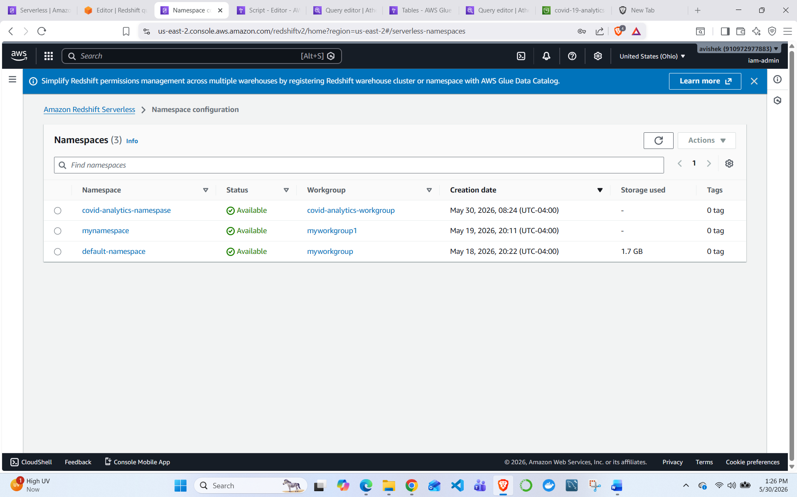

---

## Step 14 — Create IAM Role for Redshift

### Service used

AWS IAM

### Role created

```text
CovidRedshiftS3AccessRole
```

### Permissions attached

```text
AmazonRedshiftAllCommandsFullAccess
AmazonS3ReadOnlyAccess
```

### Why this step was needed

Redshift needed permission to read the Gold Parquet files from S3 during the `COPY` load.

### Security note

Before publishing screenshots publicly, crop or hide AWS account IDs and any sensitive details.

### Screenshot reference

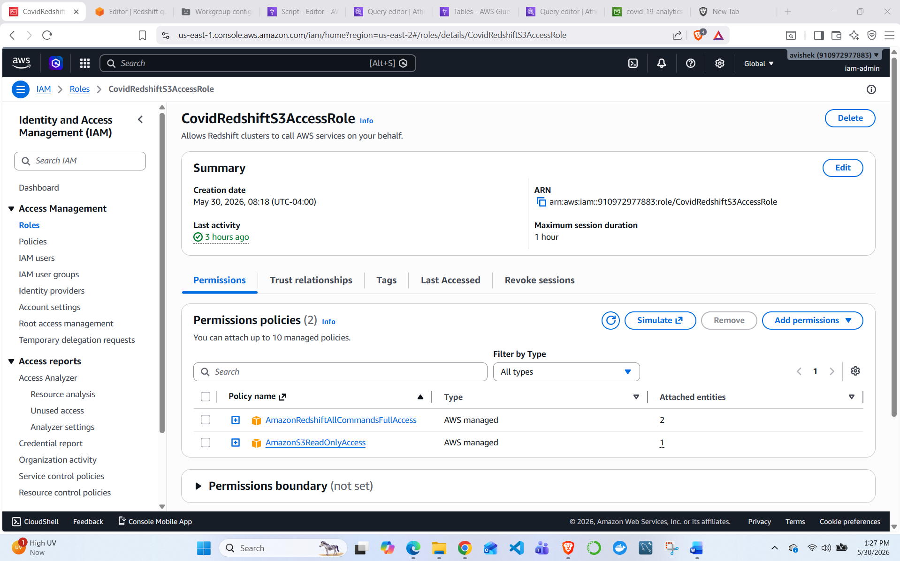

---

## Step 15 — Create Redshift Schema and Load Gold Data

### Service used

Amazon Redshift Serverless

### What I did

In Redshift Query Editor v2, I:

1. connected to the Redshift workgroup
2. used the `dev` database
3. created the `covid_gold` schema
4. created Redshift tables
5. loaded Gold Parquet files from S3 using `COPY`
6. used the Redshift IAM role
7. added the S3 bucket region during COPY

### Example SQL

```sql
CREATE SCHEMA IF NOT EXISTS covid_gold;
```

Example COPY pattern:

```sql
COPY covid_gold.dim_date
FROM 's3://covid-19-analytics-avishek/covid/gold/dim_date/'
IAM_ROLE 'arn:aws:iam::<ACCOUNT_ID>:role/CovidRedshiftS3AccessRole'
FORMAT AS PARQUET
REGION 'us-east-1';
```

### Why `REGION 'us-east-1'` was added

The S3 bucket was in `us-east-1`, so the Redshift COPY command needed the region specified.

### Screenshot reference

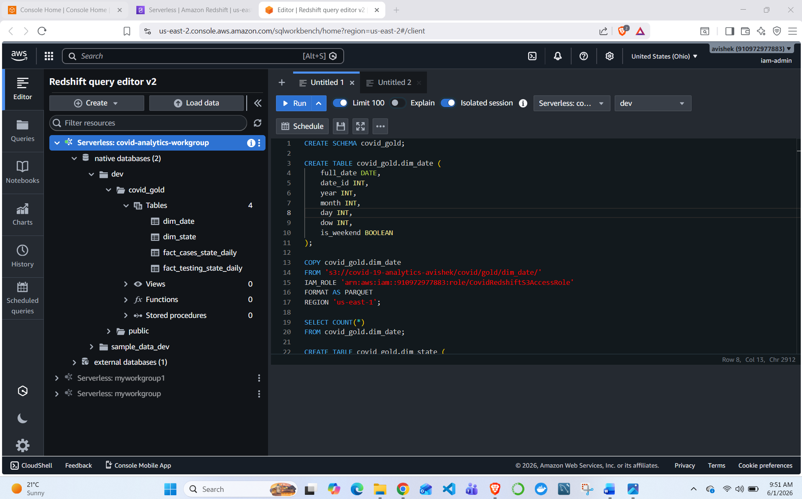

---

## Step 16 — Debug Redshift Schema Issues

### Service used

Amazon Redshift Serverless

This was one of the most important learning parts of the project.

### Issue 1 — dim_date column order

Redshift COPY from Parquet is strict. The Redshift table column order needed to match the physical Parquet schema closely.

### Issue 2 — state_code partition column

The Gold fact tables were partitioned by `state_code`.

In S3, partition columns are stored as folder names:

```text
state_code=NY/
state_code=CA/
state_code=MI/
```

Athena can read those partition values through Glue Data Catalog metadata.

Redshift COPY reads the physical Parquet file schema more strictly, so it did not handle the partition column exactly the same way.

### Fix used

For Redshift load validation, I adjusted the Redshift table definitions to match the physical Parquet files.

### What I learned

Athena and Redshift can read the same S3 Parquet data differently.

Athena works closely with Glue Data Catalog partition metadata. Redshift COPY expects the Parquet file schema to match the target table definition more directly.

This was a useful real-world issue because partitioned data can behave differently depending on the query engine or warehouse loading method.

---

## Step 17 — Validate Redshift Load

### Service used

Amazon Redshift Serverless

### What I checked

After COPY loading, I checked row counts in Redshift.

| Table | Row Count |
|---|---:|
| `covid_gold.dim_date` | 420 |
| `covid_gold.dim_state` | 51 |
| `covid_gold.fact_cases_state_daily` | 3540 |
| `covid_gold.fact_testing_state_daily` | 20780 |

I also ran:

```sql
ANALYZE VERBOSE;
```

### Why this step was needed

This validated that the Gold data could be loaded into Redshift tables for warehouse-style access.

---

## Step 18 — Run Athena BI Analytics Queries

### Service used

Amazon Athena

I used Athena for the final analytics queries because Athena correctly recognized the `state_code` partition metadata through the Glue Data Catalog.

### Dataset date range note

The original query date was changed because the available dataset went only up to:

```text
20200509
```

So I used `20200509` instead of a later date.

---

### Query 1 — Top 5 States by New Cases

```sql
SELECT
    s.state_name,
    f.new_cases
FROM covid_gold_db.fact_cases_state_daily f
JOIN covid_gold_db.dim_state s
    ON s.state_code = f.state_code
WHERE f.date_id = 20200509
ORDER BY f.new_cases DESC
LIMIT 5;
```

Result:

| State | New Cases |
|---|---:|
| New York | 2715 |
| Illinois | 2320 |
| California | 2208 |
| New Jersey | 1631 |
| Massachusetts | 1410 |

Screenshot:

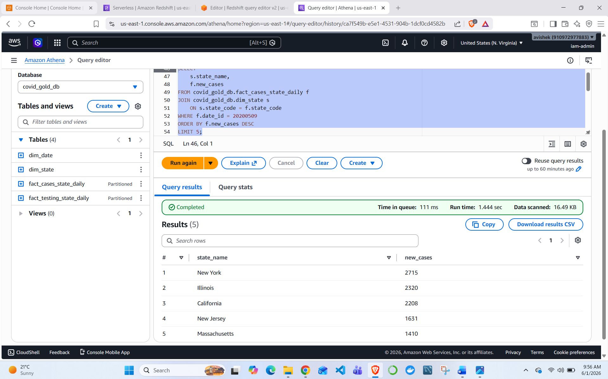

---

### Query 2 — Positivity Rate Trend for NY

```sql
SELECT
    d.full_date,
    CAST(t.tests_pos_cum AS DOUBLE) / NULLIF(t.tests_total_cum, 0) AS positivity_rate
FROM covid_gold_db.fact_testing_state_daily t
JOIN covid_gold_db.dim_date d
    ON d.date_id = t.date_id
WHERE t.state_code = 'NY'
ORDER BY d.full_date;
```

Screenshot:

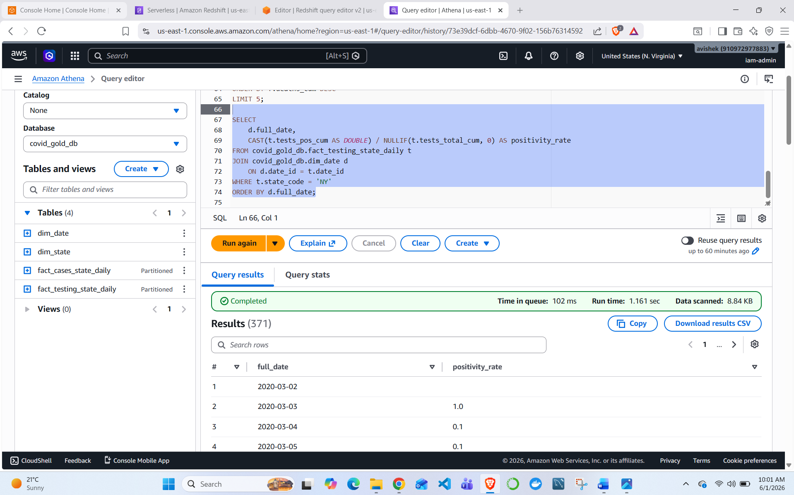

---

### Query 3 — Daily Cases vs Tests for CA

```sql
SELECT
    d.full_date,
    c.new_cases,
    t.new_tests,
    CAST(t.tests_pos_cum AS DOUBLE) / NULLIF(t.tests_total_cum, 0) AS positivity_rate
FROM covid_gold_db.fact_cases_state_daily c
JOIN covid_gold_db.fact_testing_state_daily t
    ON t.date_id = c.date_id
   AND t.state_code = c.state_code
JOIN covid_gold_db.dim_date d
    ON d.date_id = c.date_id
WHERE c.state_code = 'CA'
ORDER BY d.full_date;
```

Screenshot:

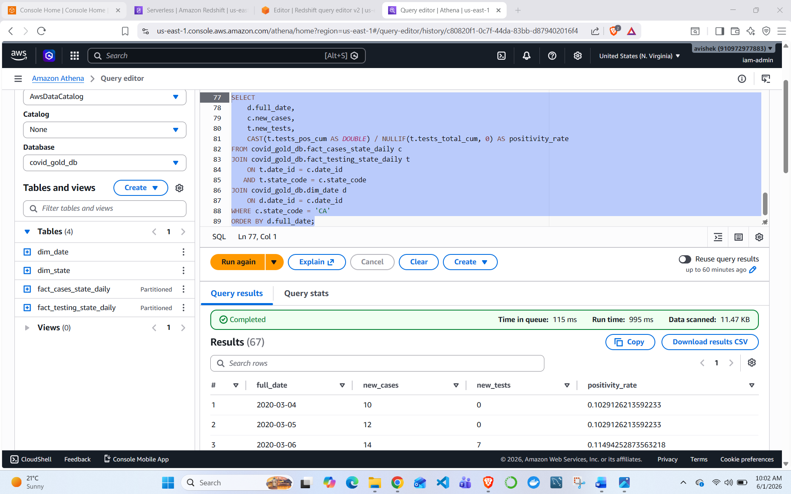

---

## Step 19 — GitHub Repository Organization

### Goal

The goal of the GitHub repo is to clearly show:

- source datasets
- project documentation
- screenshot proof
- SQL used for Athena/Redshift
- Glue ETL logic if available
- project limitations and lessons learned

### Recommended repo structure

```text
aws-covid19-analytics-pipeline/
│
├── data/
│   ├── states_abv.csv
│   ├── states_daily.csv
│   └── us_states.csv
│
├── docs/
│   └── project_steps.md
│
├── screenshots/
│   ├── 01_s3_covid_root_folders.png
│   ├── 02_s3_bronze_folders.png
│   └── ...
│
├── scripts/
│   ├── covid-bronze-to-silver.json
│   └── covid-silver-to-gold.json
│
├── sql/
│   ├── athena_bi_analytics_queries.sql
│   ├── athena_create_gold_tables.sql
│   ├── athena_create_silver_tables.sql
│   └── redshift_create_and_copy.sql
│
├── README.md
└── .gitignore
```

---

## Final Completion Summary

| Area | Status |
|---|---:|
| S3 data lake structure | Completed |
| Bronze raw datasets uploaded | Completed |
| Glue IAM role configured | Completed |
| Bronze-to-Silver Glue ETL job | Completed |
| Silver Parquet output | Completed |
| Silver Athena external tables | Completed |
| Silver metadata in Glue Data Catalog | Completed |
| Silver-to-Gold Glue ETL job | Completed |
| Gold fact and dimension tables | Completed |
| Gold Athena external tables | Completed |
| Gold metadata in Glue Data Catalog | Completed |
| Redshift Serverless setup | Completed |
| Redshift IAM role | Completed |
| Redshift schema and COPY load validation | Completed |
| Redshift schema/partition issue debugging | Completed |
| Athena BI analytics queries | Completed |
| GitHub documentation cleanup | Completed |

---

## Limitations and Lessons Learned

### Limitations

- The project was completed manually through AWS Console and SQL, not through Infrastructure as Code.
- There was no orchestration tool like Step Functions or Airflow.
- Redshift COPY needed schema adjustments because of Parquet schema and partition-column behavior.
- The project did not include a QuickSight dashboard.

### Lessons learned

- S3 folder design matters when building a data lake.
- Partitioning improves query performance but can create schema differences across tools.
- Athena and Redshift can interpret the same Parquet data differently.
- Glue ETL is useful for converting raw CSV into analytics-ready Parquet.
- A Gold layer with dimensions and facts makes analytics queries easier.
- Documentation and screenshots are important because they help explain what was built.

---

## Future Improvements

A production-quality version could add:

- Infrastructure as Code using Terraform or CloudFormation
- automated orchestration
- stronger data quality checks
- CloudWatch logging and alerting
- Redshift-ready non-partitioned export
- CI/CD deployment
- dashboarding with QuickSight or Power BI
